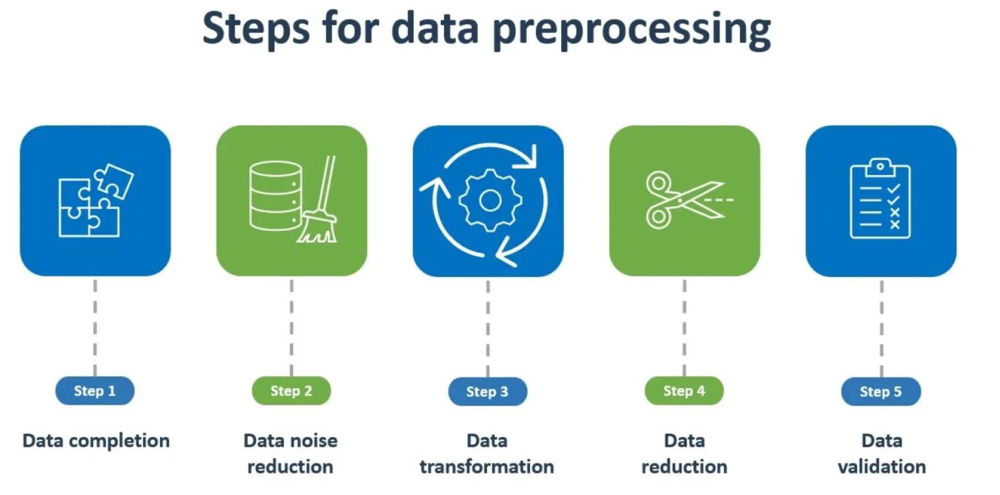
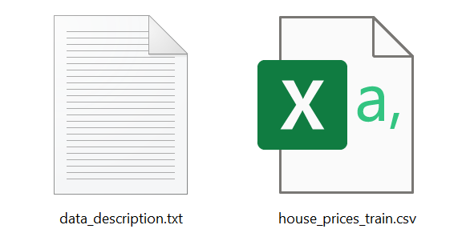
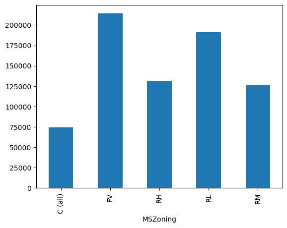
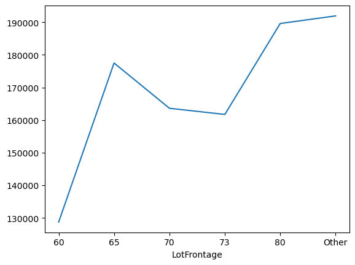
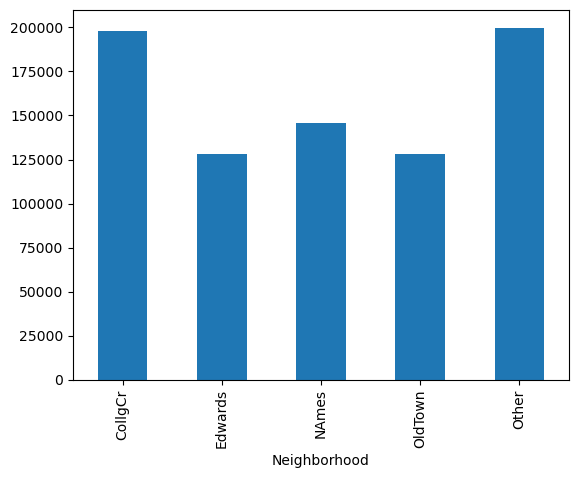
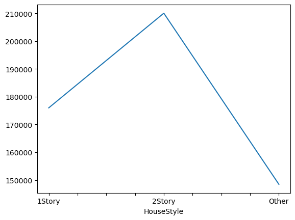
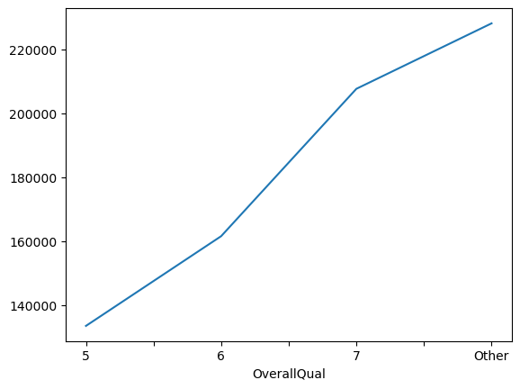
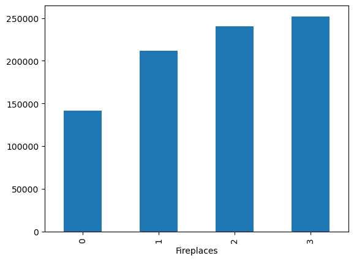

# House_Price_Forecaster
 Predicting house prices using machine learning and deep learning techniques for accurate predictions. This project involves creating a regression model to forecast house prices based on various features.

# House Price Forecaster

Hi, Welcome to the House Price Forecaster! Our project harnesses the power of machine learning and deep learning techniques to predict house prices accurately. By leveraging advanced algorithms, we aim to provide users with reliable forecasts based on various property features.

### Introduction 

Canada has experienced significant growth in its housing market over the past several years, with prices varying widely depending on location, type of property, and local market conditions. Major cities like Toronto, Vancouver, and Montreal are known for their high housing costs, driven by factors such as strong demand, limited supply, and foreign investment.

House Price Forecaster is a Python tool designed to predict house prices using advanced machine learning and deep learning algorithms. With the increasing complexity of real estate markets, accurate prediction of house prices has become crucial for both buyers and sellers. This project aims to provide a reliable solution for forecasting house prices based on key features such as square footage, number of bedrooms, number of bathrooms, location, and other relevant factors.

This Predicvtive Machine Learning Model for 'House Price Forecaster' break into three deliverables.

Deliverable 1: Data Preprocessing (Initial & Final Data)

Deliverable 2: Building and Optmization of Machine Learning Model (Initial & Final Data).

Deliverable 3: Flask-powered API & Tableau Visualizations 

## Deliverable 1: Data Preprocessing (Initial & Final Data)

Understanding the data makes us to be very conscious about preprocessing when it seems a complex data to model with higher number of features.So, we decided to explore and analyze the data in two stages.

- Initital Data Preprocessing

- Final Data Preprocessing

### 1.1 Prerequisites

Before you begin, ensure you have the following installed:

- Python 3.6 or higher

- Pandas (for data analysis)

- NumPy (for numerical computing)

- Matplotlib (for data visualization)

### 1.2 Data Sources

We use the data from the Kaggle [House Prices - Advanced Regression Techniques ](https://www.kaggle.com/competitions/house-prices-advanced-regression-techniques/data)

data_description - full description of each column, originally prepared by Dean De Cock but lightly edited to match the column names.

house_price_train.csv - occupied 81 columns with all the features and the target variable.

### 1.3 How We Did Initial Data Preprocessing

Missing values in various columns are handled using appropriate strategies such as filling with median values, replacing with "None", or imputation based on data description.

   - Several columns had missing values that were imputed with specific values:
     - `LotFrontage`: Median value of the respective neighborhood.
     - `Alley`, `MasVnrType`, `BsmtQual`, `BsmtCond`, `BsmtExposure`, `BsmtFinType1`, `BsmtFinType2`, `FireplaceQu`, `GarageType`, `GarageFinish`, `GarageQual`, `GarageCond`, `PoolQC`, `Fence`, `MiscFeature`: "None" (indicating absence or lack of the respective feature).
     - `MasVnrArea`, `BsmtFinSF1`, `BsmtFinSF2`, `BsmtUnfSF`, `TotalBsmtSF`, `BsmtFullBath`, `BsmtHalfBath`, `GarageYrBlt`, `GarageArea`, `GarageCars`: Filled with zeros.
     - `Electrical`: Filled with the mode value of the column.

Certain columns are converted to appropriate data types using astype() function, such as converting categorical variables to the 'category' data type.

   - `MSSubClass`: Converted to 'category' data type.
   - `MSZoning`: Converted to 'category' data type.
   - `Street`: Converted to 'category' data type.
   - `LotShape`: Converted to 'category' data type.
   - `LandContour`: Converted to 'category' data type.

Some categorical variables with a large number of unique values are binned to reduce dimensionality i.e. noise reduction and improve model performance. Converts certain categorical features with high cardinality into broader categories to avoid overfitting.

   - `LotFrontage`: Values were binned based on a cutoff value.
   - `Neighborhood`: Values were binned based on a cutoff value.
   - `Condition1`: Values were binned based on a cutoff value.
   - `Condition2`: Values were binned based on a cutoff value.
   - `HouseStyle`: Values were binned based on a cutoff value.
   - `OverallQual`: Values were binned based on a cutoff value.
   - `OverallCond`: Values were binned based on a cutoff value.
   - `RoofStyle`: Values were binned based on a cutoff value.
   - `RoofMatl`: Values were binned based on a cutoff value.
   - `Exterior1st`: Values were binned based on a cutoff value.
   - `Exterior2nd`: Values were binned based on a cutoff value.
   - `MasVnrArea`: Values were binned based on a cutoff value.

The preprocessed training dataset is saved to JSON and CSV as "initial_preprocessed_hp_train" files for further analysis or model training.

### 1.4 How We Make Final Data Preprocessing

- Various exploratory data analysis tasks are conducted to understand the distribution and relationships of different features with the target variable (`SalePrice`).

- Visualizing relationships between certain features and `SalePrice` using different plots such as line plots, bar plots, and histograms and checking value counts and unique values of different categorical columns like:

`MSZoning`,

`LotFrontage`

`Neighborhood`

`HouseStyle`

`OverallQual`

`Fireplaces`

- Dropping columns that are deemed less relevant or have low correlation with the target variable (`SalePrice`). These columns are stored in `columns_to_drop` and are removed from the DataFrame using `drop`.

- The final preprocessed training dataset is exported to both JSON and CSV formats for further analysis or modeling. 

## Authors

## [Maira Syed GitHub](https://github.com/mairasyed)

## [Aruna  Venkatachalam GitHub](https://github.com/arunavenkatachalam)

## [Jalees Moeen GitHub](https://github.com/JaleesMoeen)