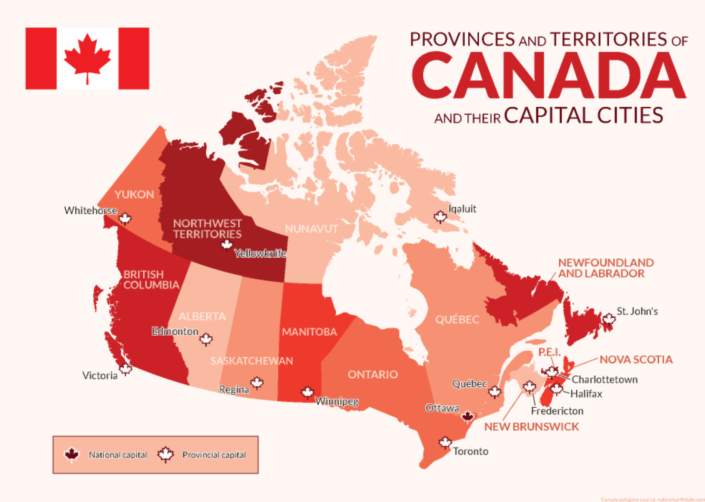

# House_Price_Forecaster
 Predicting house prices using machine learning and deep learning techniques for accurate predictions. This project involves creating a regression model to forecast house prices based on various features.

# House Price Forecaster

Hi, Welcome to the House Price Forecaster! Our project harnesses the power of machine learning and deep learning techniques to predict house prices accurately. By leveraging advanced algorithms, we aim to provide users with reliable forecasts based on various property features.

### Introduction 

Canada has experienced significant growth in its housing market over the past several years, with prices varying widely depending on location, type of property, and local market conditions. Major cities like Toronto, Vancouver, and Montreal are known for their high housing costs, driven by factors such as strong demand, limited supply, and foreign investment.

House Price Forecaster is a Python tool designed to predict house prices using advanced machine learning and deep learning algorithms. With the increasing complexity of real estate markets, accurate prediction of house prices has become crucial for both buyers and sellers. This project aims to provide a reliable solution for forecasting house prices based on key features such as square footage, number of bedrooms, number of bathrooms, location, and other relevant factors.

This Predicvtive Machine Learning Model for 'House Price Forecaster' break into three deliverables.

Deliverable 1: Data Preprocessing (Initial & Final Data)

Deliverable 2: Building and Optmization of Machine Learning Model (Initial & Final Data).

Deliverable 3: Flask-powered API & Tableau Visualizations 

## Authors

## [Maira Syed GitHub](https://github.com/mairasyed)

## [Aruna  Venkatachalam GitHub](https://github.com/arunavenkatachalam)

## [Jalees Moeen GitHub](https://github.com/JaleesMoeen)